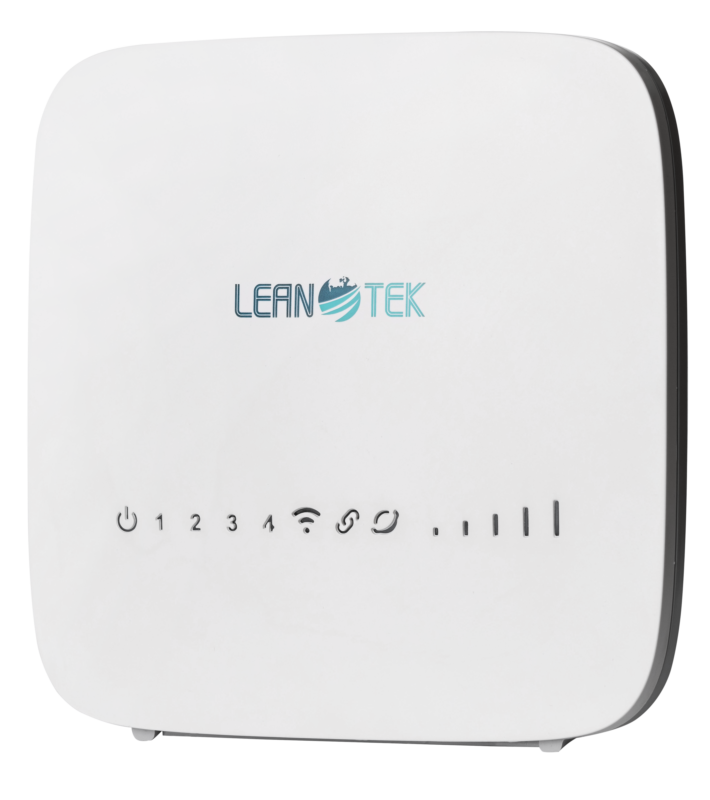

### LeanoCrypt 

If you need a powerful tool to encrypt and decrypt files and databases, LeanoCrypt has been developed for you.
This tool is developed based on Rijndael
Encryption and decryption of files is done with a key phrase determined by the user
It should be noted that LeanoCrypt hashes this key phrase with 256 bits, but the more complex key phrase, more secure it is.
This tool is also used for internal encryption of Leanotek modems

### LeanoCrypt Tasks List
- [x] Complete SQLite3 Encryption
- [ ] Complete Autoconf
- [ ] Network Packet Encryption 
- [ ] NPE Compatible with Terminator-Samurai

### Build and Install
`$ ./configure && make `

### Usage
simple usage encryption
`LeanoCrypt -e -K <key> <file>`
simple usage decryption
`LeanoCrypt -d -K <key> <file>`

for more options check `LeanoCrypt -h`
